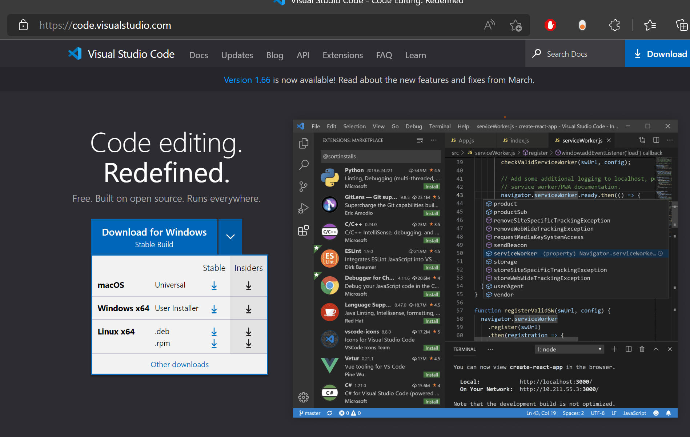
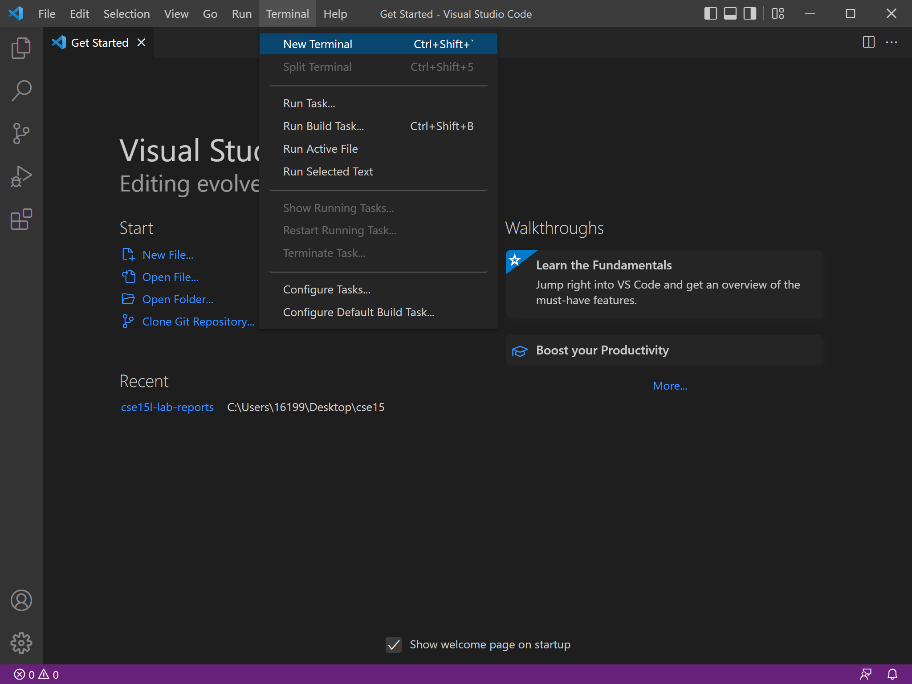
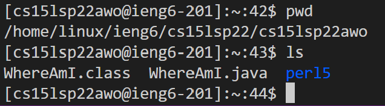
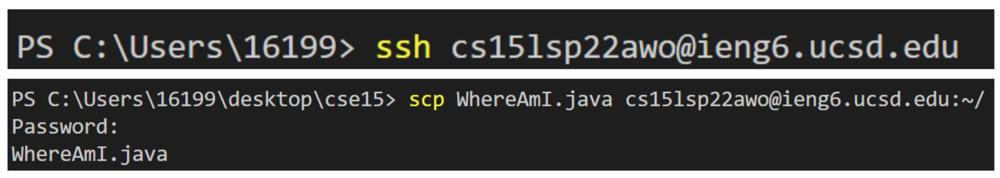

# lab report 1

## Installing VS code

* First we need to install visual studio code
* Go to [https://code.visualstudio.com](https://code.visualstudio.com) to download and install

## Remotely connecting

* install openSSH
* lookup your account at [https://sdacs.ucsd.edu/~icc/index.php](https://sdacs.ucsd.edu/~icc/index.php)
* open a terminal in VS code by doing Terminal -> New Terminal in the menu options

* type in `ssh cs15lsp22zz@ieng6.ucsd.edu` 
* replace zz with your assigned user name (ie awo)
* say yes to all the prompts, enter password
* you're now connecte!

## Run some commands
* here are some useful ones:
* `cd` will change directory
* `pwd` show the current directory
* `ls` will list the files in the current directory

* this is what it looks like (see below)

## Moving files with scp

* we can securely copy files from the client (local machine) to the server
* do the `exit` command to logout of the sever
* now do `scp <fileName.extension> cs15lsp22zz@ieng6.ucsd.edu:~/`
* this securely copies the file to the server

## Setting an SSH key

* typing our password all the time is annoying
* we can fix this with an SSH key, so we can login securely without needing to retype our password all the time
* login to the server and do `ssh-keygen`
* save the key to the file `/Users/<user-name>/.ssh/id_rsa: /Users/<user-name>/.ssh/id_rsa`
* click enter on everything, don't type anything
