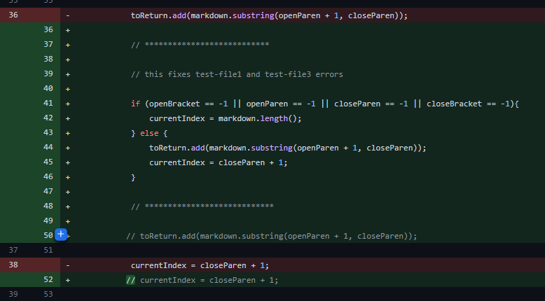
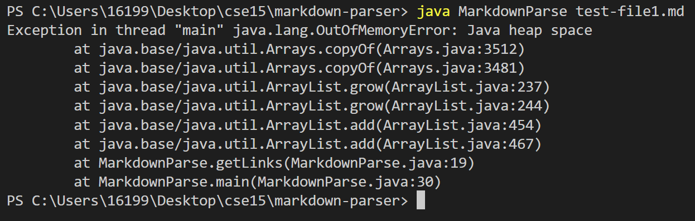
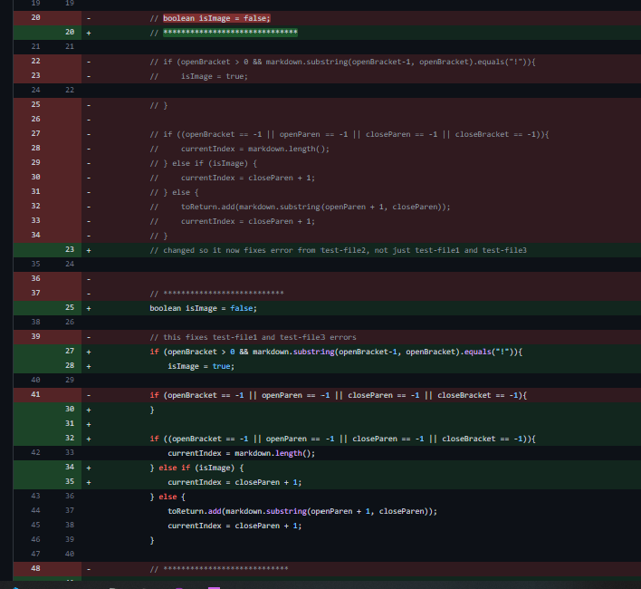
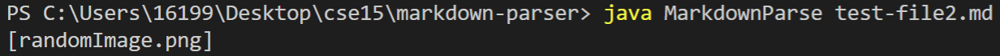
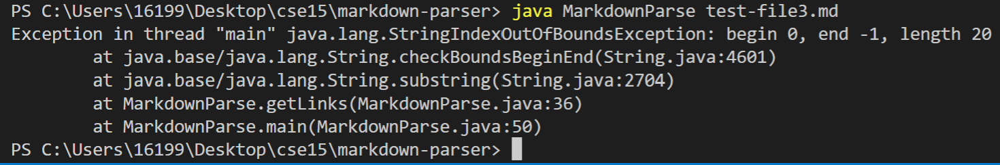

# Lab Report 2

## Code Change 1
---

[test-file1](https://github.com/badnanx/markdown-parser/blob/6bfe148eb69083bb8ab0be65761dbb3856705fcd/test-file1.md)

Symptom image (output):

In this bug the program would basically go on forever and crash when running out of memory. This was caused by ending the test file with a blank new line and the program not knowing what to do when something is out of scope (not found).

## Code Change 2
---

[test-file2](https://github.com/badnanx/markdown-parser/blob/6bfe148eb69083bb8ab0be65761dbb3856705fcd/test-file2.md)

Symptom image (output): 

In this bug, the program would report an image as a link! The syntax for links and images is almost identical, so the program could not tell the difference (brackets and parentheses are used in both). So, we needed a way for the program to differentiate between a link and an image (hint: "!"). 

## Code Change 3
---

[test-file3](https://github.com/badnanx/markdown-parser/blob/6bfe148eb69083bb8ab0be65761dbb3856705fcd/test-file3.md)

Symptom image (output): 

This bug was similar to the first one in that the program didn't know what to do when something was out of its scope (Program POV: "Where are the parentheses?!"). 

Here the inputs were obviously different. So in the test file, I just had a file that didn't contain any links, just some words between brackets. However, instead of crashing, I got a out of bounds exception. The fix for test-file3 and test-file1 were bundled together.