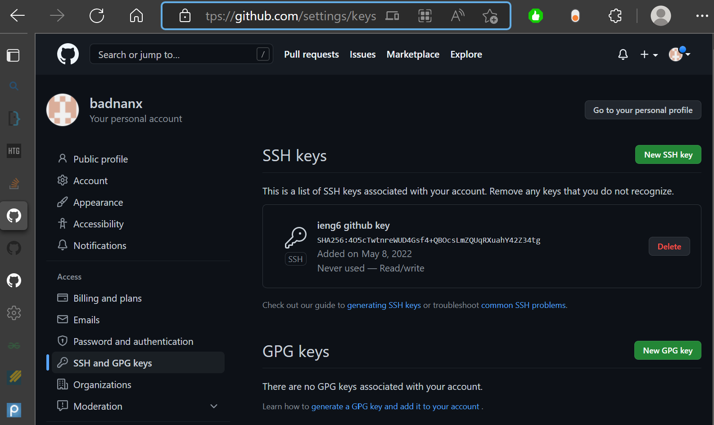

# Lab report 3

* [index](https://badnanx.github.io/cse15l-lab-reports/index.html)

## Streamlining ssh
---
* Here I made a .ssh/config file to simplify logging in to the remote machine

* now I can just use `ssh ieng6` to login

* I can also use `scp` with this method

## Setup github access from ieng6
---
* Here I made a private/public ssh key pair with ieng6 and github so I can access github from the remote machine

* Public key location on github:

* Public and private key location on ieng6:

* We can now commit and push to github from ieng6!:

* here is a link to that commit:
[HelloSaturn.txt-commit](https://github.com/badnanx/dir1-repo/blob/c27c406f676e4f96c4b1bd7431872dae97a10407/HelloSaturn.txt)

## Copy whole directories with `scp -r`
---
* We can copy entire directories with `scp -r` as shown:

* this is most faster than copying files one at a time!

* logging in to ieng and running tests:

* combining actions into one line:

