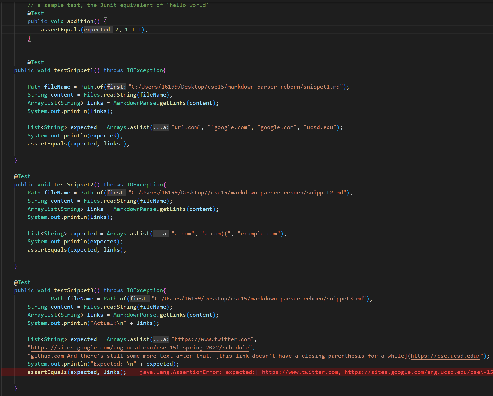

# Lab Report 4
* Snippet 1 expected output:

    `[url.com, `\``google.com, google.com, ucsd.edu]`
* Snippet 2 expected output:
    
    `[a.com, a.com((, example.com]`
* Snippet 3 expected output:

    `[https://www.twitter.com, https://sites.google.com/eng.ucsd.edu/cse-15l-spring-2022/schedule, github.com And there's still some more text after that. [this link doesn't have a closing parenthesis for a while](https://cse.ucsd.edu/]`

* Test code:

