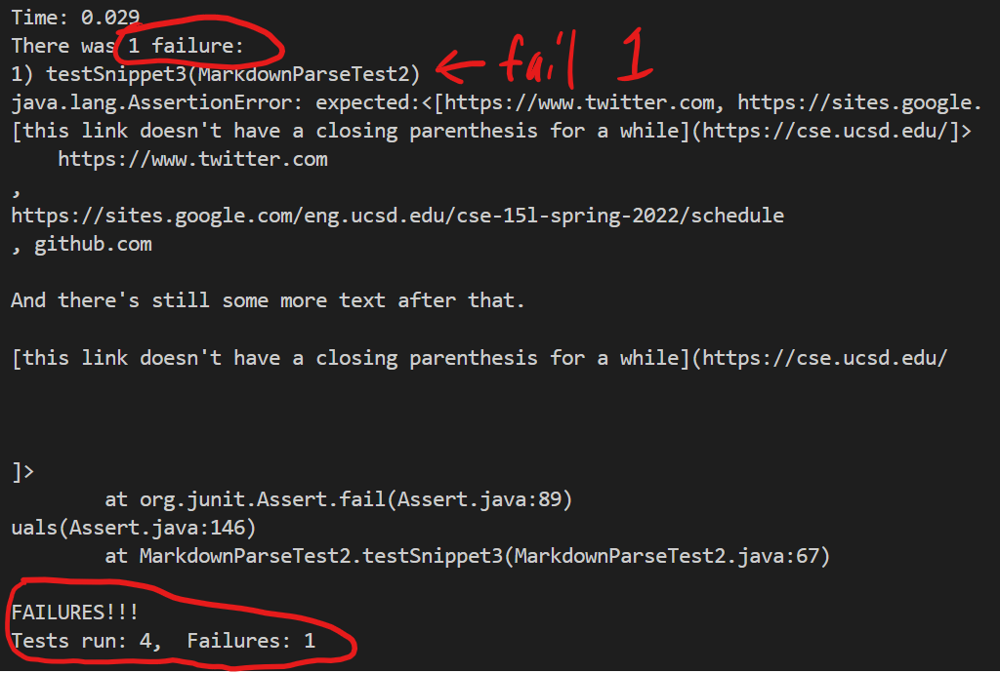
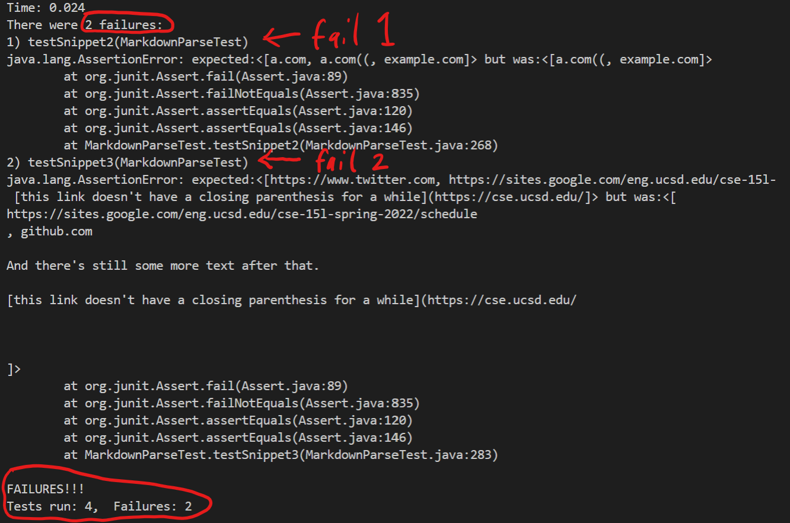

# Lab Report 4

[My Markdown Parser](https://github.com/badnanx/markdown-parser-reborn.git)

[Other student's markdown parser](https://github.com/ddn005UCSD/markdown-parser.git)

* Snippet 1 expected output:

    `[url.com, `\``google.com, google.com, ucsd.edu]`
* Snippet 2 expected output:
    
    `[a.com, a.com((, example.com]`
* Snippet 3 expected output:

    `[https://www.twitter.com, https://sites.google.com/eng.ucsd.edu/cse-15l-spring-2022/schedule, github.com And there's still some more text after that. [this link doesn't have a closing parenthesis for a while](https://cse.ucsd.edu/]`

    ---

## Test code:

---

## My output:
    
* `testSnippet1()` and `testSnippet2()` passed but `testSnippet3()` failed

---

## Other student's output:

* `testSnippet1()` passed but `testSnippet2()` and `testSnippet3()` failed

---

* Question 1: 

     My first test passed because I knew that my code does not give any special treatment to backticks, so I knew what the resultant output would be. It just treats the backticks like any other character. I think it is possible to make a small change that ignores/skips backticks, like designing an "if statement" that tells the program to ignore backticks.

* Questions 2: 

    My second test passed because I knew that my code did not give special treatment to nested parentheses, brackets, and escaped brackets so I knew the resultant output. If we were trying to get the links without those pollutants, it doesn't seem possible with a small code change. Since the program figures out where the links are based on brackets and parentheses, it would be really hard to code in all the possible combinations of misleading parentheses and brackets that need to be ignored in just ten lines or less.

* Question 3:

    The third test failed! The third snippet was really complicated. With all the random line breaks and words between everything there are simply too many cases to try and protect against and it is difficult to code a way for the program to know what is a link and what isn't in just ten lines of code.
   
    --- 
