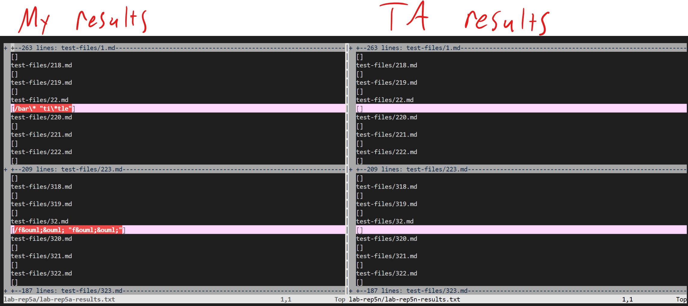

# Lab Report 5

I compared the results of two different implementations of markdown parser by first exporting their results to their own .txt files and then using vimdiff to compare the files.

The command I used was `vimdiff <filepath1> <filepath2>` from the home directory of the remote host which compares the files as shown:

MarkdownParse is meant to extract the URLs of properly formatted links ONLY. Improperly formatted links are to be ignored.

The results of my implementation are on the left and the TAs implementation on the right. For both test files (22.md and 41.md) my output was incorrect and the TAs output was correct.    

## **22.md**
---

[Link to 22.md](https://github.com/nidhidhamnani/markdown-parser/blob/main/test-files/22.md)

Expected output: `[]`

My actual output: `[/bar\* "ti\*tle"]`

### <u>Actual output comparison:</u>

---

### <u>Code preview:</u>

---

From the code preview image of 22.md we can see that we don't have a link between the parentheses. So even though the output looks good in the preview, it is only superficial as there is no link behind it. The bug in my program is that it mistook what was inside the parentheses as a valid link, as there are few checks validating potential links.

The first character of a valid link must either by a letter or a number (examples: https://www.4chan.org, www.4chan.org, 4chan.org, google.com).

In this case, I can implement some code that compares the first character after `'('` to an array containing valid first characters. If the first character after `'('` fails this test, then we know it is not a valid link.    

## **41.md**
---

[Link to 41.md](https://github.com/nidhidhamnani/markdown-parser/blob/main/test-files/41.md)

Expected output: `[]`

My actual output: `[url &quot;tit&quot;]`

### <u>Actual output comparison:</u>

---

### <u>Code preview:</u>

---

From the code preview image of 41.md, we can see that we once again don't have a valid link between the parentheses. However the reason, or bug, behind it differs. If we implemented our first fix from before (22.md), this test file would still not render the expected output because it has a valid first character for a URL (letter or number).

Instead, we can try comparing the characters inside the parentheses with a `' '` , a space. If anything inside the parentheses contains a space we know it is not a valid link.    

### **Code Screenshot**

---

